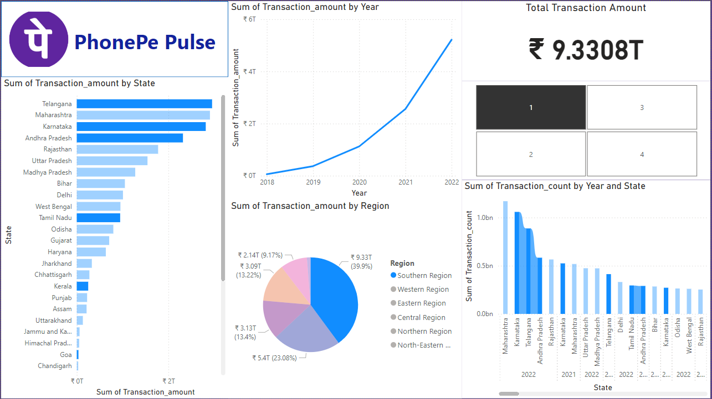

# 📊 Power BI Dashboard - PhonePe Pulse Data Analysis

## 🚀 Project Overview
This **Power BI dashboard** is created as part of my learning journey to explore data visualization and analysis using Power BI. The dashboard visualizes the **PhonePe Pulse dataset** sourced from **Kaggle**, providing insights into transaction amounts and counts across different states, regions, and years.

## 🛠️ Tools and Technologies
- **Power BI**: Used for creating interactive visuals and designing the dashboard.
- **Kaggle**: The PhonePe Pulse dataset was sourced from Kaggle.
- **Power Query Editor**: Used for data transformation and preparation.

## 🔑 Key Features
- **Interactive Visuals**: The dashboard is interactive, allowing users to filter and explore transaction data by state, region, and year.

### 📊 Visualizations:
- **Total Transaction Amount**: Displays the total transaction value across all states, years, and regions.
- **Transaction Amount by State**: A bar chart showing the sum of transaction amounts for each state.
- **Transaction Amount by Year**: A line chart tracking the growth of transaction amounts over time.
- **Transaction Amount by Region**: A pie chart illustrating the regional contributions to total transactions.
- **Transaction Count by Year and State**: A clustered bar chart comparing transaction counts across states over the years.

## 💡 Insights
This dashboard is primarily created for **learning purposes** and focuses on exploring Power BI features. It visualizes trends and patterns in transaction data across different dimensions (states, regions, years).

## 🔧 How to Use
- This dashboard is **interactive** within the Power BI file.
- You can explore transaction amounts by selecting different states, regions, and years using the available filters.

## 🙏 Acknowledgments
- **PhonePe Pulse Dataset**: The data used for this project is sourced from Kaggle’s PhonePe Pulse dataset. [Kaggle Dataset](https://www.kaggle.com/datasets)

## 📜 License
This project is shared **publicly** for learning and presentation purposes. Feel free to explore and provide feedback.
